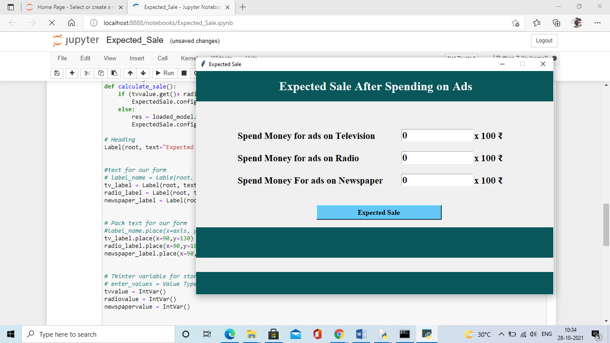

# Expected_Sale

this project create for check Expected Sale spend money on Ads( in TV, in Radio, in Newspepar) 

# Context
I do not own rights to this data. Taken from Kaggle file name is Advertising_data.

# Content
What's inside is more than just rows and columns. Make it easy for others to get started by describing how you acquired the data and what time period it represents, too.

# Acknowledgements
We wouldn't be here without the help of others. If you owe any attributions or thanks, include them here along with any citations of past research.

## Screenshots

